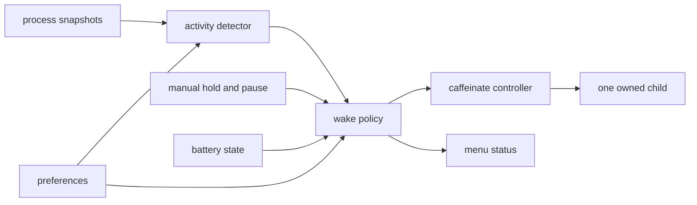

# Architecture

`slopwake` turns agent activity and manual requests into one bounded macOS wake
hold.

## Ownership

| Layer | Responsibility |
| --- | --- |
| `SlopwakeCore` | Detection state, monotonic timers, wake policy, preferences, and child lifecycle |
| App services | Process and battery sampling, login-item state, and preference storage |
| `WakeMenuModel` | Reconcile live inputs and user actions into policy, child state, and menu state |
| SwiftUI menu | Present status and send bounded actions to the model |

## Detection

Codex, Claude, and Cursor desktop and CLI surfaces are evaluated independently.
Codex Desktop sessions connected to a remote workspace are identified from the
orphaned launch shell, app-server tree, and code-mode worker, without reading
process arguments. That remote tree aggregates CPU progress from its code-mode
worker subtrees. Headless CLI processes remain active for their lifetime.
Interactive CLI and bundle-identified desktop processes use their own cumulative
CPU progress; recent activity expires after 30 quiet minutes. Claude Desktop may
also use the lifetime of its local agent descendant.

Process identity includes the PID and start time so PID reuse cannot inherit an
old session. Snapshot failures retain evidence only for currently enabled
surfaces and do not create an idle transition.

Detection is deliberately conservative and best-effort. It reads public process
metadata and counters, not user content.

## Wake policy

`WakePolicy` evaluates monotonic time, automatic evidence, manual demand,
automatic pauses, and battery state. Its result is the only input that decides
whether the controller should hold.

The policy guarantees:

- manual and automatic demand form a union;
- manual holds are limited to 30 minutes, one hour, or eight hours;
- automatic activity expires after 30 quiet minutes;
- continuous automatic demand stops after eight hours until an idle transition;
- the configured battery cutoff releases demand and fails safe when charge is
  unavailable on battery power;
- wall-clock changes cannot extend or prematurely expire timers.

## Child process

`CaffeinateController` owns at most one `/usr/bin/caffeinate` child. It uses
`-ims -w <app-pid>` by default and `-dims -w <app-pid>` when display sleep is
disabled. Flag changes replace the child through the same reconciliation path.
Requested and unexpected termination remain distinct so the menu can recover
or report an actionable error.

## Persistence

`UserDefaults` stores enabled detector surfaces, display-sleep behavior, the
battery cutoff, and the observed Start at Login state. The Service Management
API remains authoritative for the login item.

Policy timers, activity evidence, process identities, ceiling state, and pause
state are memory-only. Relaunching starts a new session.
